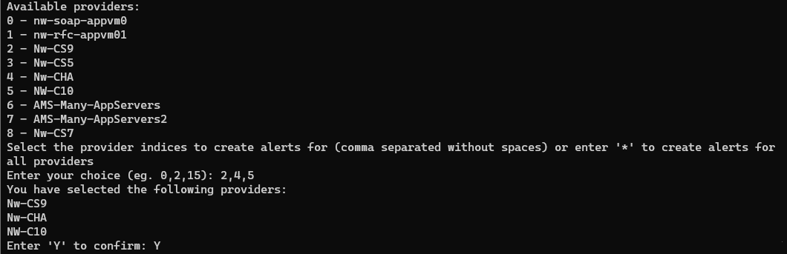
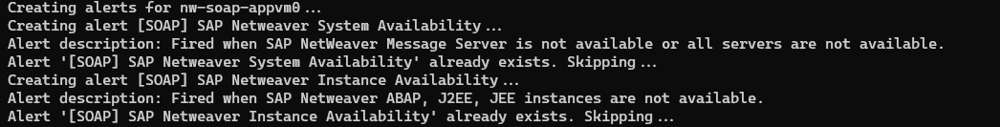
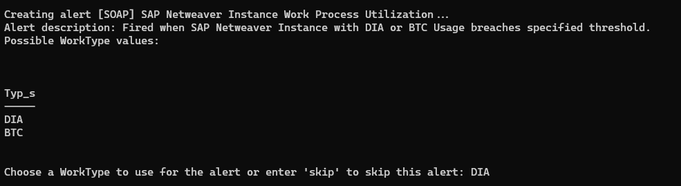
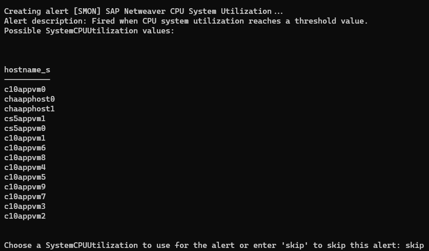

# **NetWeaver Alerts Bulk Creation**

## Clone the Repository

```shell
git clone https://github.com/Azure/Azure-Monitor-for-SAP-solutions-preview.git
```

## Prerequisites
- Either have Azure PowerShell locally installed (https://learn.microsoft.com/powershell/azure/install-azure-powershell), or use Azure Cloud Shell (https://learn.microsoft.com/azure/cloud-shell/overview)
- Connect to your Azure account using the Connect-AzAccount (https://learn.microsoft.com/powershell/module/az.accounts/connect-azaccount) cmdlet.
- Make sure you have at least contributor role on the Azure Monitor for SAP solutions resource and the associated managed Resource Group.

## Usage
- You will need to provide the values of the following parameters related to your Azure Monitor for SAP solutions resource: *subscriptionId*, *tenantId*, *rgName*, *amsResourceName*. You can also set the *alertSuppressionInMinutes* optional parameter to the number of minutes to wait before alerting again (by default it is 0).
- You are also required to set the *actionGroupResourceId* parameter to the resource ID of the action group you want to use for the alerts. For getting the resource ID of an action group from the portal, follow these steps:
    - Go to the Azure portal and navigate to the Alerts resource page.
    - Click on Action groups in the command bar at the top.
    - Navigate to the action group you want to use and click on it.
    - Click on JSON view and copy the Resource ID.
- Navigate to the directory where the script is located and execute it along with the required input parameters. Here is an example command:
```
$subscription_id = '00000000-0000-0000-0000-000000000000'
$tenant_id = '00000000-0000-0000-0000-000000000000'
$rg_name = 'Contoso-AMS-RG'
$monitor_name = 'Contoso-AMS-Monitor'
$action_group_resource_id = '/subscriptions/00000000-0000-0000-0000-000000000000/resourceGroups/Sample-RG/providers/Microsoft.Insights/actionGroups/Sample-AG'

.\NetWeaverAlertsBulkCreation.ps1 -SubscriptionId $subscription_id -TenantId $tenant_id -RgName $rg_name -AmsResourceName $monitor_name -ActionGroupResourceId $action_group_resource_id
```
- The script automatically installs the required PowerShell modules. Agree to the prompts to install the modules in case they are not already installed.
- You will then see the list of available NetWeaver providers in your AMS resources. Select the providers you want to create alerts for by entering their index. You will be asked to confirm your selection.

- Then the script will loop through the selected providers and set up the pre-configured alerts. Review the ALERTS_CONFIG variable to see the alerts that will be created. Edit/Remove any alerts as per your requirements.
- Any alerts that are already existing will be skipped. So you can safely run the script multiple times.

- Some alerts require an additional Aggregate input. The available values will be output as a table. Please copy and enter one of these values when prompted. You can also enter `skip` to skip the creation of that particular alert.


- The alerts will be created in the managed RG associated with your AMS resource. Verify that they are created successfully after the script completes execution.

## Resources
- https://learn.microsoft.com/powershell/azure/install-azure-powershell
- https://learn.microsoft.com/azure/cloud-shell/overview
- https://learn.microsoft.com/powershell/module/az.accounts/connect-azaccount
